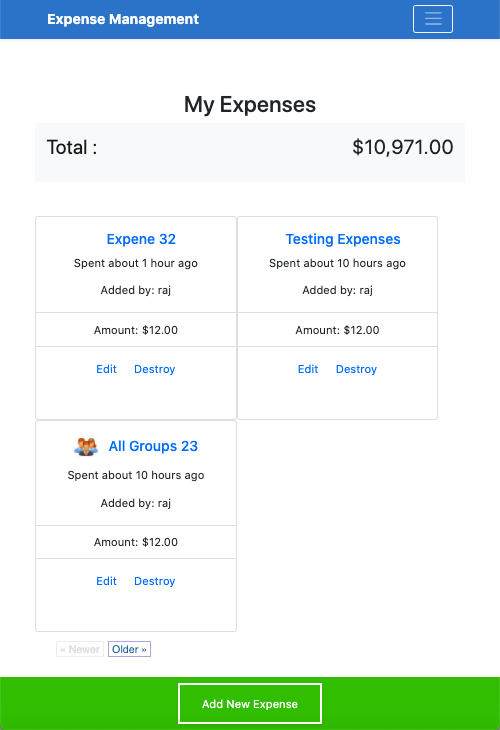
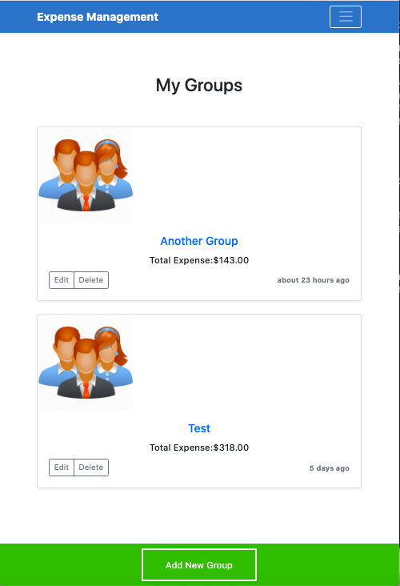

# Expense Management - Ruby on Rails Capstone Project

> Track and group your expenses







Created with Ruby on Rails.

## Built With

- Ruby on Rails
- Devise Gem for authentication
- RSpec, Capybara, FactoryBot and Shoulda-matchers for model, controller and unit testing
- Databases: SQLite3 in development and testing, PostgresQL for production

## Live Demo

- [Live Demo Link](https://rajda-expense-mgmt.herokuapp.com)
- [Presentation](https://www.loom.com/share/0cadadf278304ab79e903e21a04c21ae)

## Getting Started

To get a local copy up and running follow these simple example steps.

### Prerequisites

1. Have Ruby 2.7.0 installed
2. Have Rails 6 installed

### Setup

1. Clone this repo to your computer using <code>git clone</code> and the web url
2. Open your terminal and <code>cd</code> into the project root directory
3. As Heroku removes images approx. after an hour from your app, I'm using AWS S3 to store my images.
    When you clone this project, you need to ensure you have access to AWS console and S3 bucket, region, secret key and access key is set in your .env file locally.
    Please refer, https://medium.com/alturasoluciones/setting-up-rails-5-active-storage-with-amazon-s3-3d158cf021ff

### Install

1. Run <code>bundle install</code>
2. Install yarn packages as the terminal will prompt you to do
3. Run <code>rails db:create</code>
4. Run <code>rails db:migrate</code>
5. Run <code>Rails s</code> to start the server

### Usage

1. Open your browser at <code>localhost:3000</code>
2. Sign up and start creating Expenses and Groups

### Run tests

Run the following within the project directory:

```
    rpsec
```

## Authors

👤 **Rajkumar Das**

- Github: [@rajkumardas2701](https://github.com/rajkumardas2701)

## 🤝 Contributing

Contributions, issues and feature requests are welcome!

Feel free to check the [issues page](https://github.com/rajkumardas2701/ExpenseManagement/issues).

## Show your support

Give a ⭐️ if you like this project!

## Acknowledgments

- Thanks to [Gregoire Vella](https://www.behance.net/gregoirevellaDesign) for the design idea
- Thanks to Microverse Team 104-the-fornax for sharing learnings around Rails Association.

## 📝 License

This project is [MIT](lic.url) licensed.